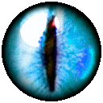

[**True Sight**][1]
====================

*let it all be revealed...*

This Firefox extension aims to expose today's most omnipresent agents in the Internet: *Content Delivery Networks (CDN)*. Nowadays, most of the global internet traffic goes through CDNs so seamlessly that the majority of the population never even finds out.

These third parties are hired by website owners *(often for "free"!)*, and their role in this ecosystem is that of messengers. They have many eyes, many hands, and they are *everywhere*. Trying to avoid them completely is not really an option anymore. They're so widespread already, that one would have to actually stop using a huge chunk of the Internet entirely in order to steer clear of them.

**...but *that* doesn't mean what they do is OK now, does it?**

I will try my best not to preach... this time around. I don't want to tell you what to do, nor whom to trust. Your newfound True Sight power will - at best - bring you awareness, because I think you deserve to at least **know** when some giant corporate ninja is sitting between you and the real servers that you *try* to visit everyday. Use this power wisely.

How does it work?
-----------------

### The toolbar icon:

Displays a color-coded badge with the number of matching patterns. This number will typically be equivalent to the number of requests served by CDNs.

YELLOW means that external resources were served by a CDN, but the page itself was not.
RED means the page itself was served by a CDN, and maybe also external resources.
PURPLE means that resources on that page were served by more than one CDN.

### The address bar icon (optional):

Uses the same colors to represent the same information, except that it doesn't have a badge (because of API limitations). Instead, the color of the icon itself changes. This icon is only visible when relevant.

### The popup:

It is displayed when you click on one of the icons. It lists the domains of the resources that were served by CDNs, and the number of detected requests by domain.

### The options:

The options menu allows you to toggle detection of individual CDNs on or off.

There is also an option to enable detection using **heuristic patterns**. Said patterns will sometimes detect CDNs that the extension doesn't allow to detect individually yet.

Platforms detected (as of 2018-09-19):
---------------------------------------

- Cloudflare
- Google Project Shield
- Incapsula
- KeyCDN
- Sucuri

There are dozens of CDNs out in the wild, so this list will definitely grow over time.

Permissions requested
---------------------

*Access your data for all websites*
- True Sight needs to analize the response headers of all requests to work, and there is no way to do that without asking for this permission.

*Access browser tabs*
- This one shouldn't be necessary (according to documentation) but, if I recall correctly, changing the address bar icon didn't seem to work without requesting this permission. Will probably check back, eventually.

TODO
----

- Add patterns to detect a bunch more CDNs.
- Improve existing patterns where possible.
- Implement dynamic themes.
- Improve the documentation.
- Make the existing UI elements more visually appealing / useful. MAYBE.
- Add some sort of accessibility option... **if** I can come up with something decent.

Privacy
--------

This extension neither collects nor shares any kind of information whatsoever. See the full privacy policy on AMO if you need a slightly longer statement telling you the same.

[1]: https://addons.mozilla.org/firefox/addon/detect-cloudflare-plus/
