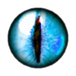

[**True Sight**][1]
====================

[][1]

This Firefox extension aims to expose today's most omnipresent agents on the Internet: *Content Delivery Networks (CDNs)*.

Did you know that at least about 70% of the global internet traffic goes through CDNs? These third parties are hired by website owners *(often for "free"!)*, to speed up their websites and protect them against attacks, among other things.

Most of the time, neither the site owners nor the CDN providers themselves make any effort to make their presence as intermediaries apparent to the end users. In fact, in most cases there is an effort to *disguise* their presence as much as possible. This is *not* nice, specially considering that some CDN providers offer services in ways that have important security and/or privacy considerations for us end users.

Your newfound True Sight power alone will not save you from anyone, but it will hopefully bring you awareness. I think we all deserve to at least **know** when some giant corporate ninja is sitting right between us and the real servers that we [so innocently *try* to reach][2] everyday. How you use this power is up to you.

Read [the description on AMO][1] to learn more about how this extension works.

Acknowledgements
----------------

Thanks to [@n8v8r][3] for the icon, and for all the feedback.

Privacy
--------

This extension neither collects nor shares any kind of information whatsoever. See the full privacy policy on AMO if you need a slightly longer statement telling you the same.

[1]: https://addons.mozilla.org/firefox/addon/detect-cloudflare-plus/
[2]: https://en.wikipedia.org/wiki/Reverse_proxy
[3]: https://github.com/n8v8r/
